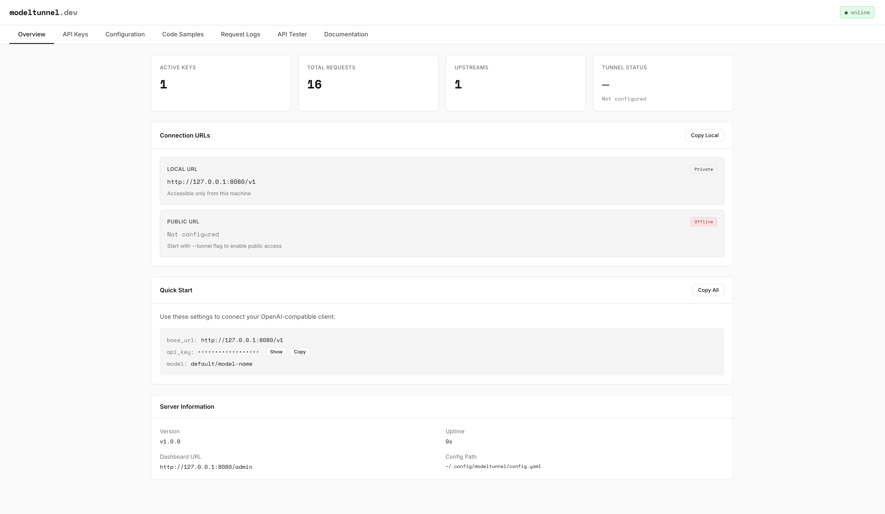

# Modeltunnel

**ngrok for LLMs** - Connect your local or cloud models with an OpenAI-compatible API, key-based authentication, and smart routing.

[](https://github.com/steliosot/modeltunnel/releases)
[](LICENSE)
[](https://goreportcard.com/report/github.com/steliosot/modeltunnel)

[Features](#features) • [Quick Start](#quick-start) • [Installation](#installation) • [Documentation](#documentation) • [Contributing](#contributing)

---

<p align="center">
  
</p>

## Features

- **Bring Your Own Backend** - Works with Ollama, vLLM, LM Studio, LocalAI, or any OpenAI-compatible endpoint
- **Key-Based Authentication** - Secure API access with granular permissions
- **OpenAI-Compatible API** - Drop-in replacement for OpenAI SDK
- **Built-in Dashboard** - Web UI for managing keys, providers, and monitoring usage
- **External Providers** - Use OpenAI, Anthropic, and other APIs alongside local models
- **Intent-Based Routing** - Smart model selection via `X-Model-Intent` header
- **Public Tunnels** - Built-in support for public access (LocalTunnel)
- **Per-Model Rate Limiting** - Different limits for different models
- **Persistent Keys** - SQLite database for key storage
- **Hot Reload** - Configuration changes apply without restart
- **Request Logging** - Real-time monitoring via WebSocket
- **Systemd Services** - Auto-restart on failure (Linux)

## Quick Start

> **Prerequisite:** Make sure your backend (Ollama/vLLM/etc.) is installed and running.

### 1. Install Modeltunnel

```bash
curl -fsSL https://raw.githubusercontent.com/steliosot/modeltunnel/main/install.sh | bash
```

### 2. Start Your Backend

```bash
# Ollama
ollama serve

# vLLM
pip install vllm
vllm serve --port 8000
```

### 3. Configure Modeltunnel

```bash
# Initialize config
modeltunnel init
```

Edit `~/.config/modeltunnel/config.yaml` to add your backend:

```yaml
upstreams:
  default:
    type: ollama              # or vllm
    base_url: http://127.0.0.1:11434  # Your backend URL
```

### 4. Start Modeltunnel

```bash
modeltunnel up
```

### 5. Open Dashboard & Create Keys

Open http://localhost:8080/admin in your browser and create an API key.

### 6. Use with Any OpenAI Client

```python
from openai import OpenAI

client = OpenAI(
    base_url="http://localhost:8080/v1",
    api_key="mt_sk_your_key_here"
)

response = client.chat.completions.create(
    model="ollama/mistral:latest",
    messages=[{"role": "user", "content": "Hello!"}]
)

print(response.choices[0].message.content)
```

### 7. Use Intent-Based Routing

```python
# Automatically selects the best model for coding
response = client.chat.completions.create(
    model="auto",
    messages=[{"role": "user", "content": "Write a Python function to sort a list"}],
    extra_headers={"X-Model-Intent": "code"}
)
```

**Available Intents:**
- `plan` → deepseek-r1 (reasoning, strategy, architecture)
- `code` → qwen2.5 (programming, debugging, technical tasks)
- `chat` → phi (fast conversation, Q&A)

---

## Installation

### One-Line Installer (Recommended)

```bash
curl -fsSL https://raw.githubusercontent.com/steliosot/modeltunnel/main/install.sh | bash
```

**Silent installation for servers/CI:**

```bash
curl -fsSL https://raw.githubusercontent.com/steliosot/modeltunnel/main/install.sh | bash -s -- --silent
```

**Installer options:**
- `--silent` - Non-interactive mode
- `--install-dir` - Installation directory (default: /usr/local/bin)
- `--help` - Show all options

**Supports:** Ubuntu, Debian, CentOS, macOS (Intel & Apple Silicon)

### Using Homebrew

```bash
brew tap steliosot/modeltunnel
brew install modeltunnel
```

### Using Go

```bash
go install github.com/steliosot/modeltunnel/cmd/modeltunnel@latest
```

### From Source

```bash
git clone https://github.com/steliosot/modeltunnel.git
cd modeltunnel
make build
sudo make install
```

### Updating Modeltunnel

```bash
curl -fsSL https://raw.githubusercontent.com/steliosot/modeltunnel/main/update.sh | sudo bash
```

**What gets preserved:**
- ✓ `~/.config/modeltunnel/config.yaml` - Your configuration
- ✓ `~/.config/modeltunnel/keys.db` - All API keys
- ✓ `~/.config/modeltunnel/tunnel.url` - Tunnel URL

### Docker

```bash
# Run with your config
docker run -d -p 8080:8080 \
  -v ~/.config/modeltunnel:/root/.config/modeltunnel \
  ghcr.io/steliosot/modeltunnel:latest up
```

## Advanced Features

### External Providers (BYOK)

Use your own OpenAI, Anthropic, or other API keys:

**Via Dashboard:**
1. Open http://localhost:8080/admin
2. Click **Providers** → **Add Provider**
3. Select provider type (OpenAI, Anthropic, ModelTunnel)
4. Enter your API key and configure models

**Via API:**
```bash
curl -X POST http://localhost:8080/admin/api/providers \
  -H "Content-Type: application/json" \
  -d '{
    "name": "My OpenAI Key",
    "type": "openai",
    "api_key": "sk-your-key-here",
    "models": ["gpt-4", "gpt-3.5-turbo"],
    "rate_limit": "100/min"
  }'
```

**Use External Models:**
```python
# Use OpenAI GPT-4 through Modeltunnel
response = client.chat.completions.create(
    model="provider-id/gpt-4",
    messages=[{"role": "user", "content": "Hello!"}]
)
```

### Async Jobs

```bash
# Submit async job
curl -X POST http://localhost:8080/v1/async \
  -H "Authorization: Bearer YOUR_KEY" \
  -d '{"model": "ollama/phi:latest", "messages": [{"role": "user", "content": "Hello"}]}'

# Check status
curl http://localhost:8080/v1/jobs/job_123... \
  -H "Authorization: Bearer YOUR_KEY"
```

### Public Tunnels

```bash
# Start with public tunnel
modeltunnel up --tunnel
```

Or use the dashboard: http://localhost:8080/admin → Click "Start Public URL"

### Connect to External Apps

Use your local models from OpenCode, Cursor, or any OpenAI-compatible app:

```bash
# Start with tunnel
modeltunnel up --tunnel

# Fill in these settings in your app:
# - Base URL: https://your-url.loca.lt/v1
# - API key: mt_sk_your_key
# - Model: ollama/mistral:latest
```

## Configuration

Configuration file: `~/.config/modeltunnel/config.yaml`

```yaml
server:
  host: 127.0.0.1
  port: 8080

upstreams:
  default:
    type: ollama
    base_url: http://127.0.0.1:11434

policies:
  default:
    rate_limit: 60/min
    max_tokens: 4096

# Intent Routing Configuration (Optional)
intents:
  plan:
    priority:
      - deepseek-r1:latest
      - qwen2.5:latest
    temperature: 0.3
    max_tokens: 4000
    description: "Planning, strategy, reasoning"

  code:
    priority:
      - qwen2.5:latest
      - mistral:latest
    temperature: 0.2
    max_tokens: 2000
    description: "Programming, debugging, technical"

  chat:
    priority:
      - phi:latest
      - tinyllama:latest
    temperature: 0.7
    max_tokens: 1000
    description: "General chat, Q&A, support"

async:
  enabled: true
  workers: 3
```

**Important:** Set `keys: []` in your config. Create keys ONLY in the dashboard UI.

## Documentation

- **[Connecting Apps](docs/CONNECTING_APPS.md)** - Connect OpenCode, Cursor, and other apps
- **[Installation Guide](docs/installation.md)** - Detailed installation instructions
- **[Configuration](docs/configuration.md)** - YAML configuration reference
- **[API Reference](docs/api.md)** - Complete API documentation with examples
- **[Async Jobs](docs/ASYNC_JOBS.md)** - Asynchronous request processing
- **[Intent Routing](docs/INTENT_ROUTING.md)** - Smart model selection
- **[CLI Reference](docs/cli.md)** - Command-line interface
- **[Examples Index](docs/EXAMPLES.md)** - Quick reference for code examples
- **[Security](SECURITY.md)** - Security best practices
- **[Contributing](CONTRIBUTING.md)** - How to contribute

## Architecture

```
┌─────────────────┐     ┌──────────────────┐     ┌─────────────────┐
│   Dashboard     │────▶│   Modeltunnel    │────▶│  Your Backend  │
│  (Web UI)       │     │   Server         │     │ (Ollama/vLLM)  │
└─────────────────┘     └──────────────────┘     └─────────────────┘
                                 │
                                 ▼
                        ┌──────────────────┐
                        │   SQLite DB      │
                        │   (API Keys)     │
                        └──────────────────┘
```

## Security

- **Authentication Required** - All API endpoints require valid keys
- **Rate Limiting** - Configurable limits per key and per model
- **Local by Default** - Binds to localhost only (127.0.0.1)
- **HTTPS Tunnels** - Public tunnels use HTTPS automatically
- **No Key Storage in Logs** - API keys are never logged

See [SECURITY.md](SECURITY.md) for details.

## Comparison

| Feature | Modeltunnel | ngrok | Cloudflare Tunnel |
|---------|-------------|-------|-------------------|
| Local LLM Support | Yes (BYO) | No | No |
| Built-in Auth | Yes | No | No |
| Dashboard | Yes | No | No |
| Async Jobs API | Yes | No | No |
| Intent-Based Routing | Yes | No | No |
| Per-Model Rate Limits | Yes | No | No |
| OpenAI API Compatible | Yes | No | No |

## License

MIT License - see [LICENSE](LICENSE) file

## Acknowledgments

- [Ollama](https://ollama.ai/) - Local LLM inference
- [LocalTunnel](https://localtunnel.me/) - Free public tunnels
- [Gorilla WebSocket](https://github.com/gorilla/websocket) - Real-time dashboard

## Community

- [GitHub Discussions](https://github.com/steliosot/modeltunnel/discussions) - Q&A and ideas
- [Issues](https://github.com/steliosot/modeltunnel/issues) - Bug reports and features

---

<p align="center">
  Made by <a href="https://github.com/steliosot">steliosot</a>
</p>